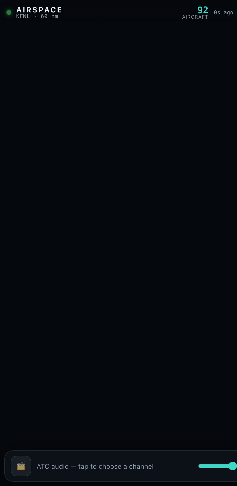

# Airspace Dashboard

A personal, real-time airspace dashboard you can install to your phone's home
screen. Fuses live ADS-B traffic, aviation weather, aircraft/route enrichment,
and ATC audio for a chosen point + radius. Single-operator, personal use.

Built per [`docs/airspace-dashboard-handoff.md`](docs/airspace-dashboard-handoff.md) (v1 data layer).



## What works today

| Layer | Source | Status |
|---|---|---|
| Live traffic (1 Hz) | airplanes.live | ✅ verified against live API |
| Weather (METAR, ~5 min) | aviationweather.gov | ✅ flight category, wind, vis, altimeter |
| Aircraft + route enrichment | adsbdb.com | ✅ type/owner/photo + origin→dest route line |
| ATC audio | LiveATC (remote) / Icecast (local) | ⚠️ config-driven; see **ATC audio** below |
| PWA / home-screen install | — | ✅ manifest, icons, offline shell, iOS install hint |

The map (MapLibre + a tokenless **raster** dark basemap — CARTO dark tiles + OFM
label glyphs) shows altitude-colored aircraft that rotate to heading, concentric
radar scope rings around the scan center, emergency/military highlighting, and a
drawn route line for the selected target. Aircraft + rings render on a dark
background **independently of the basemap**, so even if tiles fail the traffic
still shows (with an on-screen note explaining the basemap state).

> Why raster, not vector: a vector basemap depends on a hosted style.json + glyph
> pbf + sprite + a vector-tile-decoding web worker — any of which can silently fail
> on a given device and leave a black canvas. Raster has one moving part (PNG
> tiles) and renders on anything with a WebGL context. Set
> `NEXT_PUBLIC_MAP_STYLE=<style-json-url>` to use a vector style instead.

## Run it

```bash
npm install
npm run dev          # http://localhost:3000
# or, to open it from your phone on the same Wi-Fi/Tailscale:
npm run dev:lan      # serves on 0.0.0.0; open http://<this-machine-ip>:3000 on the phone
```

Production:

```bash
npm run build && npm run start
```

## Configure it

Everything personal lives in [`lib/config.ts`](lib/config.ts):

- `home` — default lat/lon/radius (ships as **KALB**, Albany / Catskills, 60 nm).
- `weatherStations` — ICAO codes for the weather panel.
- `audioChannels` — seed ATC streams (you can also add/remove them in-app).
- `presets` — quick-pick locations in the in-app location sheet.

Outbound requests use a custom User-Agent; override with `AIRSPACE_USER_AGENT`.
Override the basemap with `NEXT_PUBLIC_MAP_STYLE=<style-json-url>`.

### Changing location in-app

Tap the **KALB · 60 nm ▾** label in the status bar to open the location sheet:
**Use my location** (GPS), **Scan map center**, a radius slider (10–250 nm), and
quick presets. Or just pan the map and tap the **⊕ Scan this area** pill that
appears. Your chosen location persists across reloads, and the ADS-B query +
scope rings re-center to it immediately.

## Putting it on your phone, "wherever I am"

The PWA is the client; the `/api/*` proxy routes must run somewhere your phone can
reach. Two good options:

1. **Tailscale + your always-on box (recommended for the local-Icecast path).**
   Run `npm run start` on the Ubuntu box, reach it at its Tailscale name from the
   phone anywhere. Long-running server = the audio proxy can stream indefinitely.
2. **Vercel (simplest public deploy).** `vercel deploy` works for traffic/weather/
   enrichment and direct-play audio. Caveat: the **audio _proxy_** streams a live
   feed, which can exceed serverless function time limits — fine for direct remote
   streams and local play, not ideal for long proxied sessions. Use option 1 if you
   rely on the proxy.

Then on the phone: open the URL in Safari/Chrome → **Share → Add to Home Screen**.
It launches full-screen with no browser chrome (the app already sets the PWA
manifest, theme color, and safe-area insets for the notch).

## ATC audio (the honest part)

No radio hardware yet, so audio defaults to **LiveATC** remote streams. Audio
sources are config — never hardcoded in components — keeping the personal-use
boundary clean and making a future local receiver a drop-in swap.

- **Direct play from your phone is the most reliable path.** LiveATC sits behind
  Cloudflare; a normal phone browser passes it, automated/server fetches often don't.
- If a seeded stream won't play, open the feed page on liveatc.net, copy the current
  stream URL (the `.pls` address or the listed stream host), and paste it via the
  audio bar's **+ Add stream**. Channels persist in `localStorage`.
- **http Icecast on an https PWA is blocked as mixed content** — for your own
  RTLSDR-Airband feed over Tailscale, the app automatically routes it through the
  same-origin proxy (`/api/audio`). You can also force the proxy per-channel with
  the **proxy** checkbox when adding a stream.
- The proxy has an SSRF guard: public hosts allowed, private/loopback hosts only if
  they're a configured channel host, cloud-metadata endpoints always blocked.

Seeded Colorado channels (KAPA / KBJC / KDEN) are best-effort — the streaming host
on liveatc.net rotates, so verify/replace them in-app if needed. The map + weather +
enrichment stand entirely on their own if audio needs a fresh URL.

## Architecture

```
client (PWA): MapLibre + Zustand store + 1 Hz poller
        │ same-origin fetch
Next.js route handlers /api/*  (User-Agent, single-flight rate limit, normalize, cache)
        │
airplanes.live · aviationweather.gov · adsbdb.com      audio: client → /api/audio (proxy) or direct
```

- `lib/rateLimit.ts` — single-flight lock + ≥1000 ms upstream spacing, so even with
  several tabs open, airplanes.live is never hit faster than 1 req/sec. Between
  refreshes every caller gets the last cached frame; errors serve stale, not blank.
- `lib/sources/*` + `lib/normalize.ts` — built against the **current** (June 2026)
  API schemas. Notes: `alt_baro` can be the string `"ground"`; METAR `altim` is hPa
  (converted to inHg); `visib` can be `"10+"`.
- Enrichment is **lazy** (only on target selection), memoized in-process, and route
  data is kept in memory only (not persisted) per adsbdb's terms.

## Built-in resilience

- Every external call has a timeout + try/catch; 429/5xx triggers exponential backoff.
- A dead source degrades only its own panel — the rest stays live.
- Frames are marked `stale` after missed cycles so the UI dims/labels them instead of
  blanking.
- The 1 Hz traffic loop pauses when the tab is hidden and resumes on return.

## Fast-follow seams (left open, not built — handoff §8)

Airspace/sectional overlay (OpenAIP), 3D (deck.gl behind the `MapView` boundary),
alerting (subscribe to the store's frame stream → Openclaw webhook), DVR/history.
Emergency/military highlighting is already wired via the `isNotable` selector.

## Regenerate icons

```bash
npm run icons   # rasterizes the radar-scope SVG to public/*.png via sharp
```
